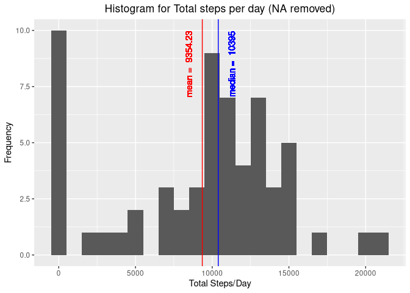
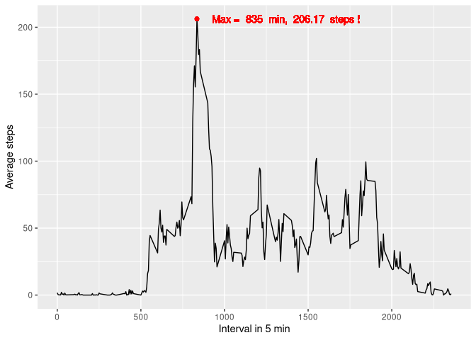
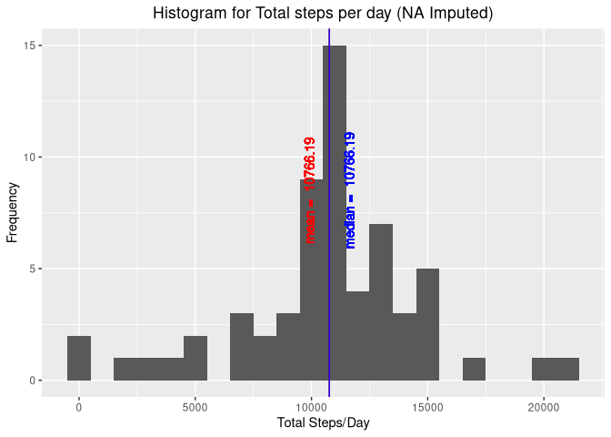
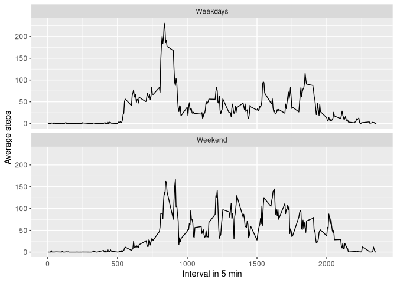

## Loading and preprocessing the data

```r
unzip("activity.zip")
Act <- read.csv("activity.csv")
Act$date <- as.Date(Act$date)
```

## What is mean total number of steps taken per day?

```r
library(dplyr)
```

```
## 
## Attaching package: 'dplyr'
```

```
## The following objects are masked from 'package:stats':
## 
##     filter, lag
```

```
## The following objects are masked from 'package:base':
## 
##     intersect, setdiff, setequal, union
```

```r
library(ggplot2)
summary <- Act%>%group_by(date)%>%summarize(total=sum(steps, na.rm=TRUE))
summary%>%ggplot(aes(x=total))+
     geom_histogram(binwidth = 1000)+
     labs(x="Total Steps/Day", y="Frequency", title="Histogram for Total steps per day (NA removed)")+
     theme(plot.title = element_text(hjust=0.5))+
     geom_vline(xintercept=c(mean(summary$total), median(summary$total)), color=c("red","blue")) +
     geom_text(aes(x=round(mean(total)), label=paste("mean = ", round(mean(total),2)), y= 8.5), 
               color="red", angle=90, vjust = -1.5)+
     geom_text(aes(x=round(median(total)), label=paste("median = ", round(median(total),2)), y= 8.5), 
               color="blue", angle=90, vjust = 2.5)+
     ggsave("./instructions_fig/Plot1.png")
```

```
## Saving 7 x 5 in image
```

<!-- -->


## What is the average daily activity pattern?

```r
Act%>%group_by(interval)%>% summarize(means=mean(steps, na.rm=TRUE))%>%ggplot(aes(interval, means))+geom_line()+
     geom_point(aes(x=interval[which.max(means)], y=max(means)), color="red")+
     geom_text(aes(x=interval[which.max(means)], y=max(means), 
                   label=paste("Max = ", interval[which.max(means)], " min, ", round(max(means), 2), " steps !")), 
               color="red", hjust= -0.1)+
     labs(x= "Interval in 5 min", y="Average steps")+
     ggsave("./instructions_fig/Plot2.png")
```

```
## Saving 7 x 5 in image
```

<!-- -->

## Imputing missing values


```r
sum(is.na(Act$steps))
```

```
## [1] 2304
```

```r
#Imputing mission values using the mean for that 5-minute interval
Act2 <- Act%>%group_by(interval)%>%mutate(steps=ifelse(is.na(steps), mean(steps, na.rm=TRUE), steps))

summary2 <- Act2%>%group_by(date)%>%summarize(total=sum(steps, na.rm=TRUE))
summary2 %>% ggplot(aes(x=total))+
     geom_histogram(binwidth = 1000)+
     labs(x="Total Steps/Day", y="Frequency", title="Histogram for Total steps per day (NA Imputed)")+
     theme(plot.title = element_text(hjust=0.5))+
     geom_vline(xintercept=c(mean(summary2$total), median(summary2$total)), color=c("red","blue")) +
     geom_text(aes(x=round(mean(total)), label=paste("mean = ", round(mean(total),2)), y= 8.5), 
               color="red", angle=90, vjust = -1.5)+
     geom_text(aes(x=round(median(total)), label=paste("median = ", round(median(total),2)), y= 8.5), 
               color="blue", angle=90, vjust = 2.5)+
     ggsave("./instructions_fig/Plot3.png")
```

```
## Saving 7 x 5 in image
```

<!-- -->


## Are there differences in activity patterns between weekdays and weekends?

```r
Act3 <- Act2 %>% mutate (days=weekdays(date))%>%mutate(daygp=ifelse(days=="Sunday"| days=="Saturday", "Weekend", "Weekdays"))%>%mutate(daygp=factor(daygp))

Act3 %>%group_by(daygp, interval)%>%summarize(means=mean(steps, na.rm=TRUE))%>%
     ggplot(aes(interval, means))+
     geom_line()+
     facet_wrap(.~daygp, nrow=2)+
     labs(x= "Interval in 5 min", y="Average steps")+
     ggsave("./instructions_fig/Plot4.png")
```

```
## Saving 7 x 5 in image
```

<!-- -->


